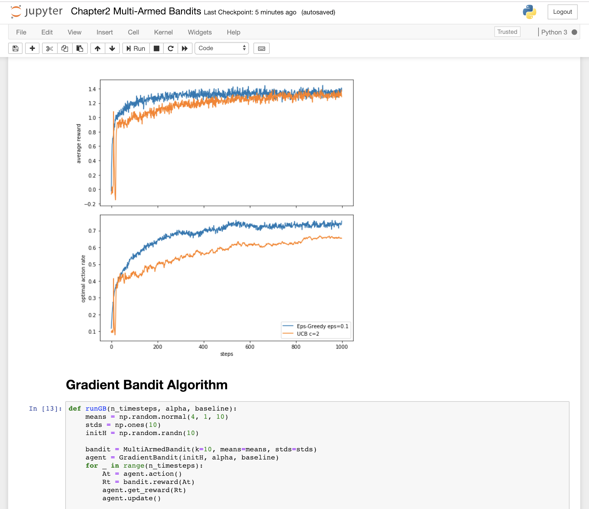

# RLPractical
This python library is meant to help the students doing [Reinforcement Learning](https://www.inf.ed.ac.uk/teaching/courses/rl/) in University of Edinburgh. Basic algorithms mentioned in the lecture or on the [textbook](http://incompleteideas.net/book/the-book-2nd.html) would be implemented. You are encouraged to tune the parameters in the algorithm to test your understanding or even implement your own agent. **Note: It's still an unstable version. API might change later on.** And Docs are still incompelte.

Clone this repo and install rlp.
```
git clone https://github.com/JZ95/RLPractical.git
cd RLPractical
python setup.py install
```
or use develop mode:
```
python setup.py develop
```

open python shell, and type the following command to test if install successfully
```
import rlp
```
-------------
## Example
### 10-Armed Bandit DEMO
```
from rlp.multi_armed_bandits.envs import MultiArmedBandit
from rlp.multi_armed_bandits.agents import EpsGreedy

means = np.random.normal(0, 1, 10)               # assign mean rewards for 10 arms
stds = np.ones(10)                               # assign std for 10 arms
initQ = np.zeros(10)                         	 # assign inital action-value estimates Q0

bandit = MultiArmedBandit(k=10, means=means, stds=stds)
agent = EpsGreedy(eps=0.1, Q0=initQ)             # build eps(0.1)-greedy agent

# run agent 1000 timesteps
for _ in range(1000):
    At = agent.action()                          # agent selects action
    Rt = bandit.act(At)                          # environment gives reward based on agent's action
    agent.set_experience(Rt)                     # agent reveives reward and updates status
    agent.update()
```

### Dynamic Programming Grid World DEMO
```
from rlp.dynamic_programming.solver import DPGridWorldSolver
from rlp.dynamic_programming.base import DPGridWorldAgent, DPGridWorldEnv

agent = DPGridWorldAgent(5, 5, discountRatio=0.99)             # build a dp gridword agent, set discountRatio as 0.99
env_model = DPGridWorldEnv(5, 5, terminals=[(0, 0), (4, 4)])   # build a dp gridword environment, set terminal state as (0, 0) and (4, 4)
solver = DPGridWorldSolver(agent, env_model)                   # build a dp solver

stats = {}
for k in range(10):                                            # run policy iteration
    solver.policy_eval()                                       # policy evaluation
    solver.policy_improve()                                    # policy improvment
    values = solver.agent.V
    policy = solver.agent.policy

    stats[k] = (values, policy)                                # record result
```

### Monte Carlo Method
```
TBD
```

-------------
## Run Notebooks
Please install jupyter first.
After installing jupyter and rlp, open NoteBook Server.
```
jupyter notebook
```
Open an another shell and
```
cd notebooks
```
See the notebooks and have fun.




🍺 ENJOY!
